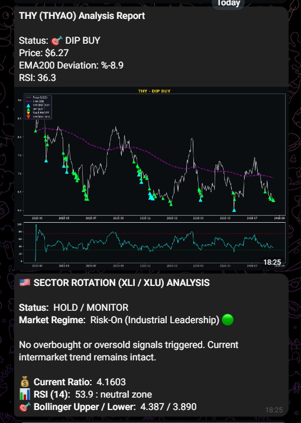

# Autonomous Multi-Market Financial & Regime Analysis Bot 📈🤖

An automated quantitative analysis and multi-asset monitoring suite built in Python. It evaluates global equities, commodities, cryptocurrencies, and macroeconomic indicators using technical indicators (EMA, RSI, ADX, Bollinger Bands), generates dark-mode visual dashboards with Matplotlib, and dispatches real-time automated reports via Telegram Bot API.

---

## 🚀 Key Features

* **Multi-Asset Coverage:** Monitors Borsa Istanbul equities (Tüpraş, Aselsan, THY), US markets (S&P 500), commodities (Spot Gold), cryptocurrencies (Bitcoin), and currency rates (USD/TRY).
* **Quantitative Regime Tracking:** Detects bull/bear market regimes and trend strengths using Exponential Moving Averages (EMA), Relative Strength Index (RSI), Average Directional Index (ADX), and customized volatility bands.
* **Pro-Grade Visualization:** Automatically plots clean, dark-themed charts (`#0B0E11` aesthetic) featuring neon trend lines, custom annotation overlays, and embedded dashboard summaries.
* **Telegram Integration:** Sends unified alert messages containing rich text formatting, status indicators, dynamic market commentary, and visual attachments.
* **Modular Architecture:** Easily scalable for additional tickers, custom trading strategies, and scheduled cloud execution.


---

## 📊 Sample Output & Dashboard

<p align="center">
  
</p>

---

## 🛠️ Tech Stack & Libraries

* **Language:** Python 3.x
* **Data Retrieval:** `yfinance`
* **Data Processing & Math:** `pandas`, `numpy`
* **Data Visualization:** `matplotlib` (with custom path effects and subplots)
* **API Dispatch:** `requests`


---

## ⚠️ Disclaimer
This repository is for educational, informational, and research purposes only. The scripts and analyses generated by these bots do **not** constitute financial, investment, or trading advice. Always conduct your own research and consult with a licensed professional before making any financial decisions.


---

## 📂 Project Structure

```text
├── bst_bot.py                 # Borsa Istanbul multi-stock valuation & deviation tracker
├── bitcoin_bot.py             # Bitcoin capitulation/euphoria & volatility band scanner
├── gold_bot.py                # Spot Gold (GC=F) balanced bull strategy monitor
├── sp500_bot.py               # S&P 500 trend analyzer with custom neon dashboard overlay
├── bulletin_header.py         # Aesthetic daily market report bulletin formatter
└── config.py.example          # Template for Telegram API credentials

---


⚙️ Installation & Configuration
Clone the repository:

Bash
git clone [https://github.com/yourusername/financial-analysis-bot.git](https://github.com/yourusername/financial-analysis-bot.git)
cd financial-analysis-bot
Install dependencies:

Bash
pip install yfinance pandas numpy matplotlib requests
Set up credentials:
Set your Telegram Bot Token and Chat ID as environment variables (TELEGRAM_TOKEN, TELEGRAM_CHAT_ID) or via a local config.py file.

⚡ Automated Execution via GitHub Actions
You can run these scripts 100% free and automatically using GitHub Actions without needing a dedicated server.

Go to your GitHub repository Settings > Secrets and variables > Actions.

Add two repository secrets:

TELEGRAM_TOKEN

TELEGRAM_CHAT_ID

Create a workflow file at .github/workflows/market_bot.yml:

YAML
name: Automated Market Analysis

on:
  schedule:
    - cron: '0 8 * * 1-5' # Runs every weekday at 08:00 UTC
  workflow_dispatch:

jobs:
  run-bots:
    runs-on: ubuntu-latest
    steps:
      - name: Checkout Repository
        uses: actions/checkout@v4

      - name: Set up Python
        uses: actions/setup-python@v5
        with:
          python-version: '3.10'

      - name: Install Dependencies
        run: |
          python -m pip install --upgrade pip
          pip install yfinance pandas numpy matplotlib requests

      - name: Run Bitcoin Bot
        env:
          TELEGRAM_TOKEN: ${{ secrets.TELEGRAM_TOKEN }}
          TELEGRAM_CHAT_ID: ${{ secrets.TELEGRAM_CHAT_ID }}
        run: python bitcoin_bot.py

      - name: Run Gold Bot
        env:
          TELEGRAM_TOKEN: ${{ secrets.TELEGRAM_TOKEN }}
          TELEGRAM_CHAT_ID: ${{ secrets.TELEGRAM_CHAT_ID }}
        run: python gold_bot.py

      - name: Run S&P 500 Bot
        env:
          TELEGRAM_TOKEN: ${{ secrets.TELEGRAM_TOKEN }}
          TELEGRAM_CHAT_ID: ${{ secrets.TELEGRAM_CHAT_ID }}
        run: python sp500_bot.py
📄 License
This project is open-source and available under the MIT License.
